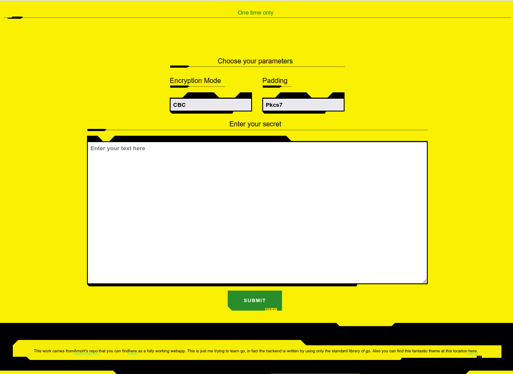
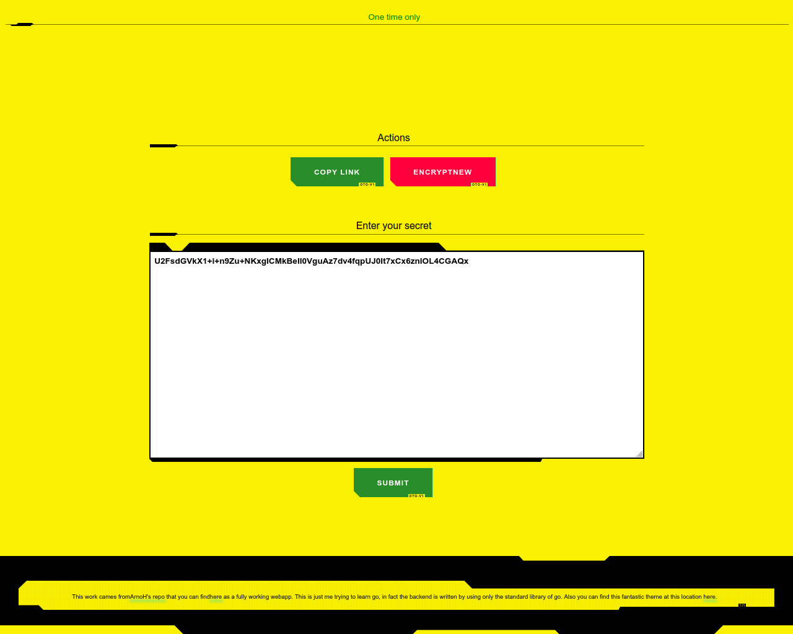
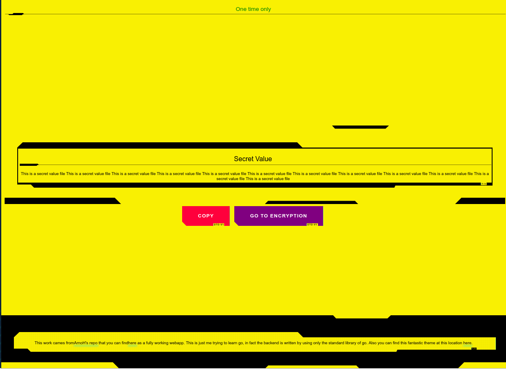

# Go-oneTimeOnly
Just like oneTimeOnly but written in go, inspired by [onetimeonly](https://bitbucket.org/arnoh/onetimeonly/src/master/), you can find the original source [here](https://bitbucket.org/arnoh/onetimeonly/src/master/) 


The theme of the frontend has been taken from [here](https://github.com/gwannon/Cyberpunk-2077-theme-css)  

# BACKEND
Just 
```
go run backend/main.go
```
For writing the server logic only the stdard library and mux as been used.

The secrets are store in the memory of the server only.

# Frontend
Just run npm
```
npm start
```

# Result

When you create the secret by choosing some parameters of the encryption, for now just mode and padding.



One you submit your secret you can copy it and send the link, the other user just need the link that carry the password used to encrypt the secret 



The decryption page, which you use to get and decrypt your secret:




