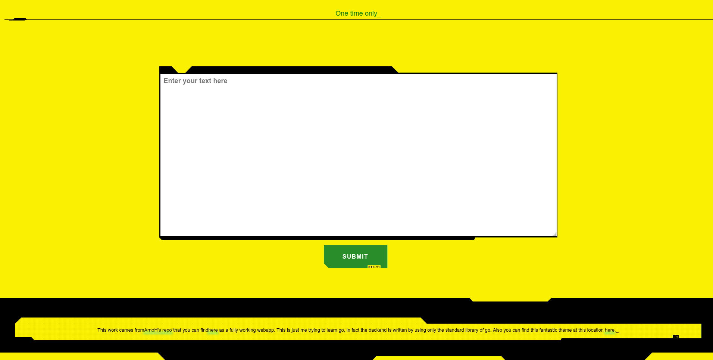

# Go-oneTimeOnly
Just like oneTimeOnly but written in go, inspired by [onetimeonly](https://bitbucket.org/arnoh/onetimeonly/src/master/), you can find the original source [here](https://bitbucket.org/arnoh/onetimeonly/src/master/) 


The theme of the frontend has been taken from [here](https://github.com/gwannon/Cyberpunk-2077-theme-css)  



# BACKEND
Just 
```
go run backend/main.go
```
The secrets are store in the memory of the server only.

# Frontend
Just run npm
```
npm start
```

